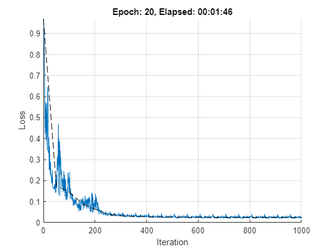

# Fourier Neural Operator

[](https://www.mathworks.com/matlabcentral/fileexchange/####-file-exchange-title)  
<!-- Add this icon to the README if this repo also appears on File Exchange via the "Connect to GitHub" feature --> 

The Fourier Neural Operator (FNO) [1] is a neural operator with an integral kernel parameterized in Fourier space. This allows for an expressive and efficient architecture. Applications of the FNO include weather forecasting and, more generically, finding efficient solutions to the Navier-Stokes equations which govern fluid flow.

## Setup 
Add `fno` directory to the path.

```matlab
addpath(genpath('fno'));
```

## Requirements

Requires:
- [MATLAB](https://www.mathworks.com/products/matlab.html) (R2021b or newer)
- [Deep Learning Toolbox&trade;](https://www.mathworks.com/products/deep-learning.html)

## References
[1] Zongyi Li, Nikola Kovachki, Kamyar Azizzadenesheli, Burigede Liu, Kaushik Bhattacharya, Andrew Stuart, and Anima
Anandkumar. Fourier Neural Operator for Parametric Partial Differential Equations. In International Conference on
Learning Representations (ICLR), 2021a. (https://openreview.net/forum?id=c8P9NQVtmnO)

# Example: Fourier Neural Operator for 1d Burgers' Equation

In this example we apply the Fourier Neural Operator to learn the one-dimensional Burgers' equation with the following definition:

> ,    

> ,    

where  and  is the Reynolds number. Periodic boundary conditions are imposed across the spatial domain. We learn the operator mapping the initial condition  to the solution at time : .

## Data preparation

We use the `burgers_data_R10.mat`, which contains initial velocities  and solutions  of the Burgers' equation. We then use these as training inputs and targets respectively. The network inputs include the spatial domain  at the desired discretization. In this example we choose a grid size of .

```matlab:Code
% Setup.
addpath(genpath('fno'));

% Download training data.
dataDir = fullfile('data');
if ~isfolder(dataDir)
    mkdir(dataDir);
end
dataFile = fullfile(dataDir,'burgers_data_R10.mat');
if ~exist(dataFile, 'file')
    location = 'https://ssd.mathworks.com/supportfiles/nnet/data/burgers1d/burgers_data_R10.mat';
    websave(dataFile, location); 
end
data = load(dataFile, 'a', 'u');
x = data.a;
t = data.u;

% Specify the number of observations in training and test data, respectively. 
numTrain = 1e3;
numTest = 1e2;

% Specify grid size and downsampling factor.
h = 2^10;
n = size(x,2);
ns = floor(n./h);

% Downsample the data for training.
xTrain = x(1:numTrain, 1:ns:n);
tTrain = t(1:numTrain, 1:ns:n);
xTest = x(end-numTest+1:end, 1:ns:n);
tTest = t(end-numTest+1:end, 1:ns:n);

% Define the grid over the spatial domain x.
xmax = 1;
xgrid = linspace(0, xmax, h);

% Combine initial velocities and spatial grid to create network
% predictors.
xTrain = cat(3, xTrain, repmat(xgrid, [numTrain 1]));
xTest = cat(3, xTest, repmat(xgrid, [numTest 1]));
```

## Define network architecture

Here we create a `dlnetwork` for the Burgers' equation problem. The network accepts inputs of dimension `[h 2 miniBatchSize]`, and returns outputs of dimension `[h 1 miniBatchSize]`. The network consists os multiple blocks which combine spectral convolution with regular, linear convolution. The convolution in Fourier space filters out higher order oscillations in the solution, while the linear convolution learns local correlations.

```matlab:Code
numModes = 16;
width = 64;

lg = layerGraph([ ...
    convolution1dLayer(1, width, Name='fc0')
    
    spectralConvolution1dLayer(width, numModes, Name='specConv1')
    additionLayer(2, Name='add1')
    reluLayer(Name='relu1')
    
    spectralConvolution1dLayer(width, numModes, Name='specConv2')
    additionLayer(2, Name='add2')
    reluLayer(Name='relu2')
    
    spectralConvolution1dLayer(width, numModes, Name='specConv3')
    additionLayer(2, Name='add3')
    reluLayer(Name='relu3')
    
    spectralConvolution1dLayer(width, numModes, Name='specConv4')
    additionLayer(2, Name='add4')
    
    convolution1dLayer(1, 128, Name='fc5')
    reluLayer(Name='relu5')
    convolution1dLayer(1, 1, Name='fc6')
    ]);

lg = addLayers(lg, convolution1dLayer(1, width, Name='fc1'));
lg = connectLayers(lg, 'fc0', 'fc1');
lg = connectLayers(lg, 'fc1', 'add1/in2');

lg = addLayers(lg, convolution1dLayer(1, width, Name='fc2'));
lg = connectLayers(lg, 'relu1', 'fc2');
lg = connectLayers(lg, 'fc2', 'add2/in2');

lg = addLayers(lg, convolution1dLayer(1, width, Name='fc3'));
lg = connectLayers(lg, 'relu2', 'fc3');
lg = connectLayers(lg, 'fc3', 'add3/in2');

lg = addLayers(lg, convolution1dLayer(1, width, Name='fc4'));
lg = connectLayers(lg, 'relu3', 'fc4');
lg = connectLayers(lg, 'fc4', 'add4/in2');

numInputChannels = 2;
XInit = dlarray(ones([h numInputChannels 1]), 'SCB');
net = dlnetwork(lg, XInit);

analyzeNetwork(net)
```

## Training options

The network is trained using the standard SGDM algorithm, where the learn rate is decreased every `stepSize` iterations.

```matlab:Code
executionEnvironment = "gpu";

batchSize = 20;
learnRate = 1e-3;
momentum = 0.9;

numEpochs = 20;
stepSize = 100;
gamma = 0.5;
expNum = 1;
checkpoint = false;
expDir = sprintf( 'checkpoints/run%g', expNum );
if ~isfolder( expDir ) && checkpoint
    mkdir(expDir)
end

vel = [];
totalIter = 0;

numTrain = size(xTrain,1);
numIterPerEpoch = floor(numTrain./batchSize);
```

## Training loop

Train the network.

```matlab:Code
if executionEnvironment == "gpu" && canUseGPU
    xTrain = gpuArray(xTrain);
    xTest = gpuArray(xTest);
end

start = tic;
figure;
clf
lineLossTrain = animatedline('Color', [0 0.4470 0.7410]);
lineLossTest = animatedline('Color', 'k', 'LineStyle', '--');
ylim([0 inf])
xlabel("Iteration")
ylabel("Loss")
grid on

% Compute initial validation loss.
y = net.predict( dlarray(xTest, 'BSC') );
yTest = extractdata(permute(stripdims(y), [3 1 2]));
relLossTest = relativeL2Loss(yTest , tTest);
addpoints(lineLossTest, 0, double(relLossTest/size(xTest,1)))

% Main loop.
lossfun = dlaccelerate(@modelLoss);
for epoch = 1:numEpochs
    % Shuffle the data.
    dataIdx = randperm(numTrain);
    
    for iter = 1:numIterPerEpoch
        % Get mini-batch data.
        batchIdx = (1:batchSize) + (iter-1)*batchSize;
        idx = dataIdx(batchIdx);
        X = dlarray( xTrain(batchIdx, :, :), 'BSC' );
        T = tTrain(batchIdx, :);
        
        % Compute loss and gradients.
        [loss, dnet] = dlfeval(lossfun, X, T, net);

        % Update model parameters using SGDM update rule.
        [net, vel] = sgdmupdate(net, dnet, vel, learnRate, momentum);

        % Plot training progress.
        totalIter = totalIter + 1;
        D = duration(0,0,toc(start),'Format','hh:mm:ss');
        addpoints(lineLossTrain,totalIter,double(extractdata(loss/batchSize)))
        title("Epoch: " + epoch + ", Elapsed: " + string(D))
        drawnow
        
        % Learn rate scheduling.
        if mod(totalIter, stepSize) == 0
            learnRate = gamma.*learnRate;
        end
    end
    % Compute validation loss and MSE.
    y = net.predict( dlarray(xTest, 'BSC') );
    yTest = extractdata(permute(stripdims(y), [3 1 2]));
    relLossTest = relativeL2Loss( yTest , tTest );
    mseTest = mean( (yTest(:) - tTest(:)).^2 );
    
    % Display progress.
    D = duration(0,0,toc(start),'Format','hh:mm:ss');
    numTest = size(xTest, 1);
    fprintf('Epoch = %g, train loss = %g, val loss = %g, val mse = %g, total time = %s. \n', ...
        epoch, extractdata(loss)/batchSize, relLossTest/numTest, mseTest/numTest, string(D));
    addpoints(lineLossTest, totalIter, double(relLossTest/numTest))
    
    % Checkpoints.
    if checkpoint
        filename = sprintf('checkpoints/run%g/epoch%g.mat', expNum, epoch);
        save(filename, 'net', 'epoch', 'vel', 'totalIter', 'relLossTest', 'mseTest', 'learnRate');
    end
end
```

```text:Output
Epoch = 1, train loss = 0.226405, val loss = 0.175389, val mse = 7.73286e-05, total time = 00:00:13. 
Epoch = 2, train loss = 0.153691, val loss = 0.145805, val mse = 5.99213e-05, total time = 00:00:22. 
Epoch = 3, train loss = 0.0923258, val loss = 0.0904608, val mse = 2.49174e-05, total time = 00:00:27. 
Epoch = 4, train loss = 0.102122, val loss = 0.0639219, val mse = 1.43723e-05, total time = 00:00:32. 
Epoch = 5, train loss = 0.0346076, val loss = 0.0393621, val mse = 9.33419e-06, total time = 00:00:36. 
Epoch = 6, train loss = 0.0361029, val loss = 0.032303, val mse = 7.10724e-06, total time = 00:00:45. 
Epoch = 7, train loss = 0.0270364, val loss = 0.0296161, val mse = 6.43696e-06, total time = 00:00:50. 
Epoch = 8, train loss = 0.0263171, val loss = 0.0283881, val mse = 5.92292e-06, total time = 00:00:54. 
Epoch = 9, train loss = 0.0248211, val loss = 0.0261364, val mse = 5.54218e-06, total time = 00:00:58. 
Epoch = 10, train loss = 0.0243392, val loss = 0.0253596, val mse = 5.32946e-06, total time = 00:01:03. 
Epoch = 11, train loss = 0.0236119, val loss = 0.0250861, val mse = 5.22886e-06, total time = 00:01:07. 
Epoch = 12, train loss = 0.023318, val loss = 0.024752, val mse = 5.12552e-06, total time = 00:01:11. 
Epoch = 13, train loss = 0.0230901, val loss = 0.0243369, val mse = 5.04185e-06, total time = 00:01:16. 
Epoch = 14, train loss = 0.0229644, val loss = 0.0241713, val mse = 4.99882e-06, total time = 00:01:20. 
Epoch = 15, train loss = 0.0228391, val loss = 0.0240904, val mse = 4.99516e-06, total time = 00:01:25. 
Epoch = 16, train loss = 0.022768, val loss = 0.0240143, val mse = 4.97173e-06, total time = 00:01:29. 
Epoch = 17, train loss = 0.0228152, val loss = 0.023916, val mse = 4.95474e-06, total time = 00:01:33. 
Epoch = 18, train loss = 0.022787, val loss = 0.0238792, val mse = 4.94643e-06, total time = 00:01:38. 
Epoch = 19, train loss = 0.0227602, val loss = 0.023865, val mse = 4.93665e-06, total time = 00:01:42. 
Epoch = 20, train loss = 0.0227464, val loss = 0.0238451, val mse = 4.93358e-06, total time = 00:01:46. 
```



## Test on unseen, higher resolution data

Here we take the trained network and test on unseen data with a higher spatial resolution than the training data. This is an example of zero-shot super-resolution.

```matlab:Code
gridHighRes = linspace(0, xmax, n);

idxToPlot = numTrain+(1:4);
figure;
for p = 1:4
    xn = dlarray(cat(1, x(idxToPlot(p),:), gridHighRes),'CSB');
    yn = predict(net, xn);

    subplot(2, 2, p)
    plot(gridHighRes, t(idxToPlot(p),:)), hold on, plot(gridHighRes, extractdata(yn))
    axis tight
    xlabel('x')
    ylabel('U')
end
```


### Helper functions

```matlab:Code
function [loss, grad] = modelLoss(x, t, net)
y = net.forward(x);
y = permute(stripdims(y), [3 1 2]);
y = stripdims(y);

loss = relativeL2Loss(y, t);

grad = dlgradient(loss, net.Learnables);
end

function loss = relativeL2Loss(y, t)
diffNorms = normFcn( (y - t) );
tNorms = normFcn( t );

loss = sum(diffNorms./tNorms, 1);
end

function n = normFcn(x)
n = sqrt( sum(x.^2, 2) );
end
```

Copyright 2022-2023 The MathWorks, Inc.
